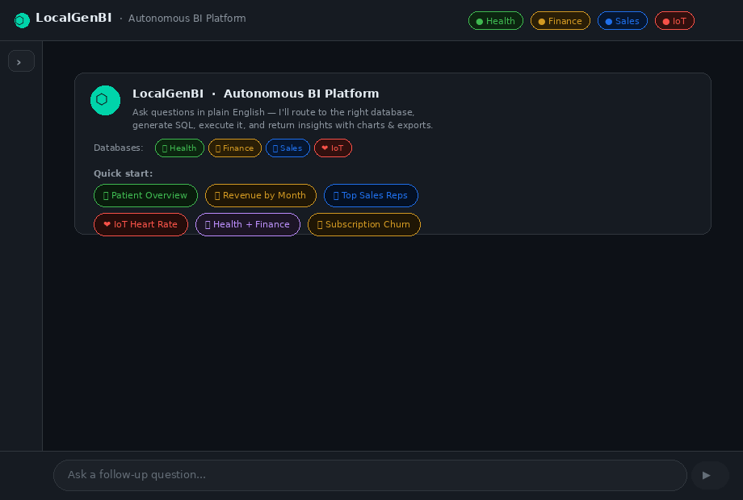
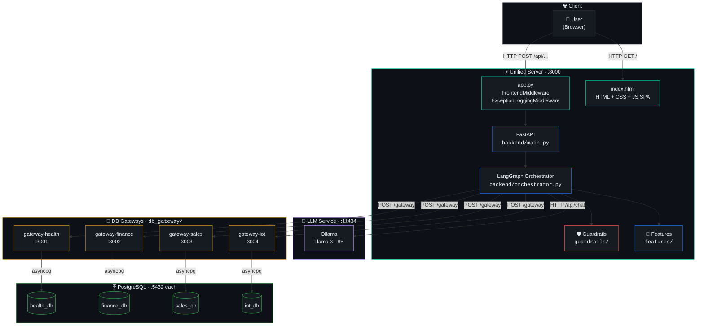
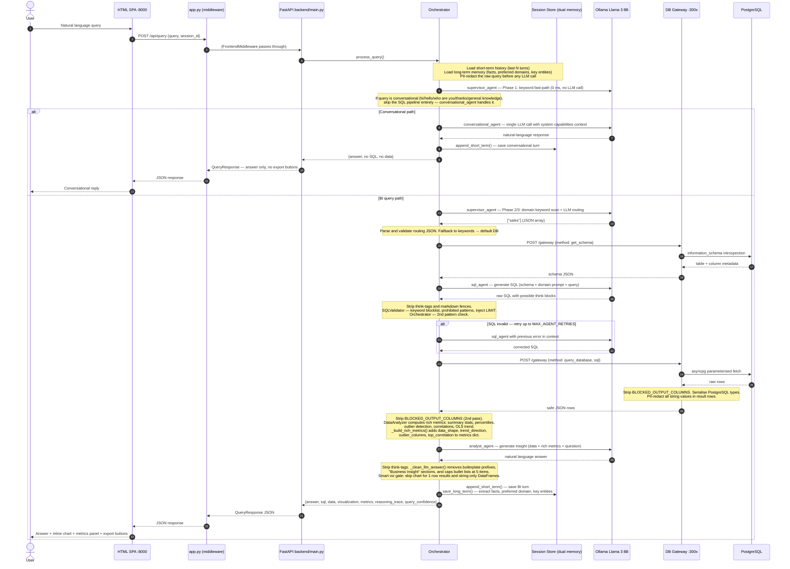
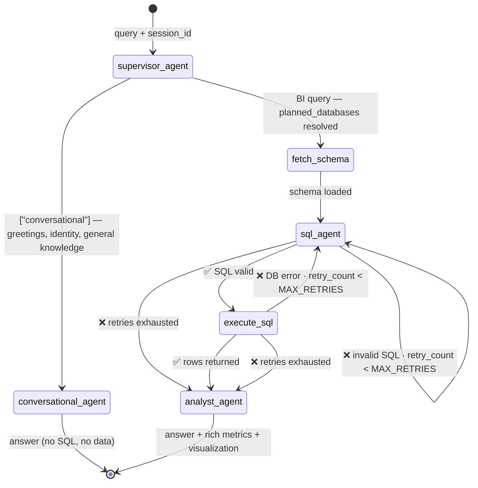
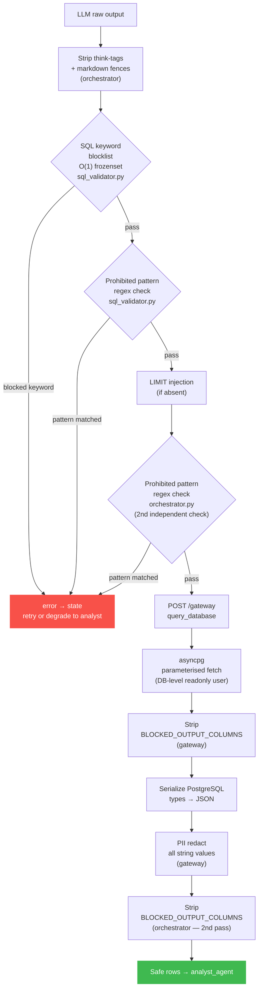
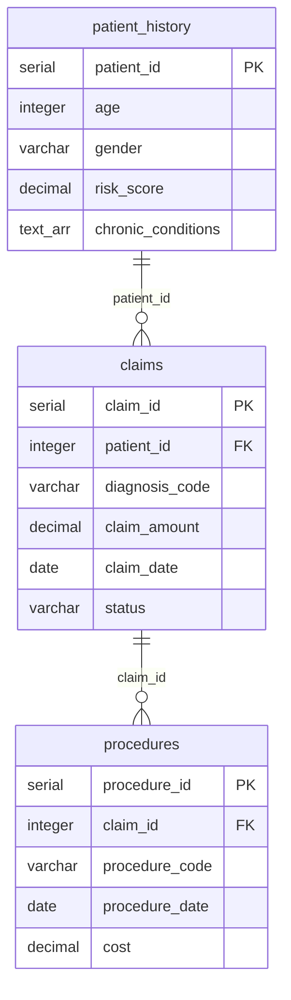
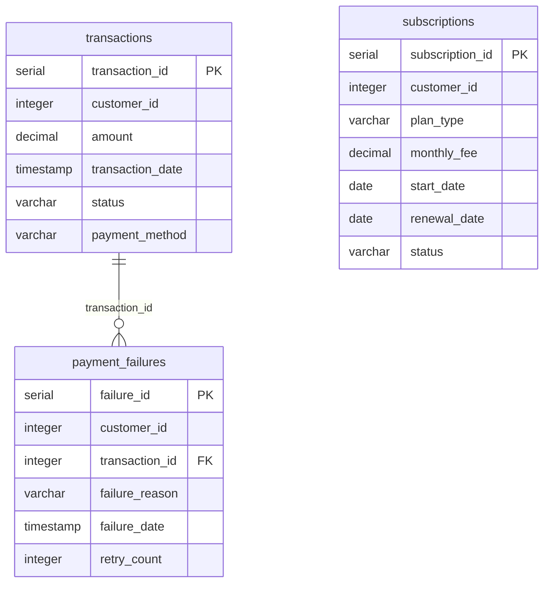
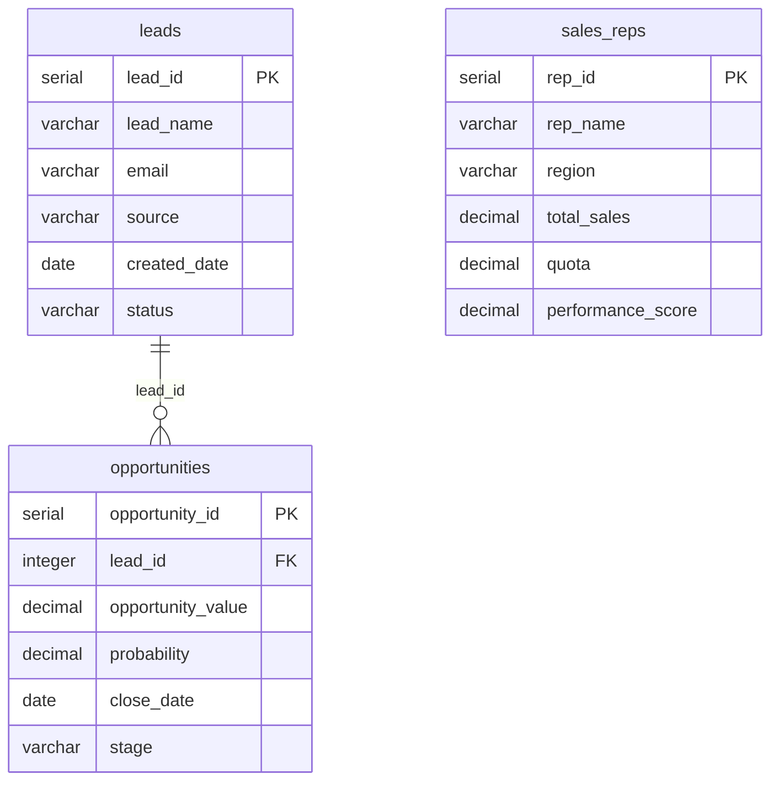
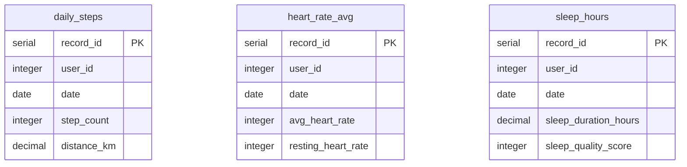
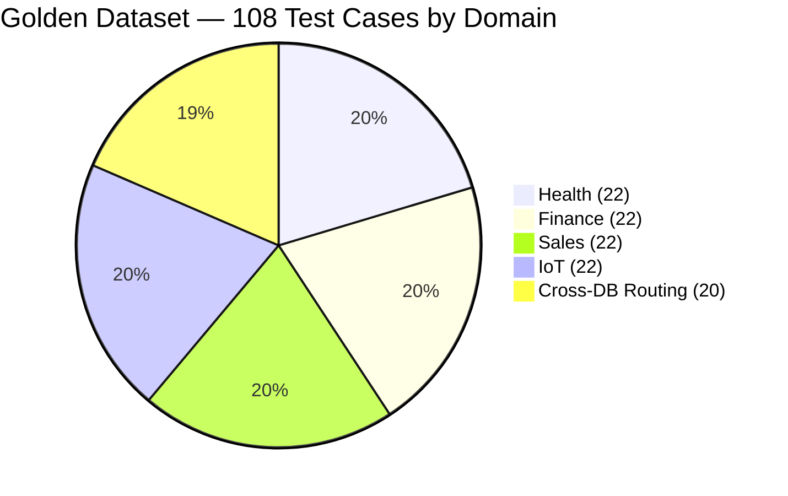

<div align='center'>

# LocalGenBI-Agent


> **This is a proof-of-concept / MVP.**
> It is a research and exploration project — not a production-ready system.
> There is no user authentication, no multi-tenancy, and no TLS between internal services.
> The LLM will generate incorrect SQL on complex multi-join queries.
> Read [Limitations](#limitations) before deploying outside your local machine.

*A locally-running generative BI agent that translates natural-language questions into SQL, routes them to the correct isolated PostgreSQL database, executes validated queries, and returns an analytical answer with an optional chart — all without sending data to any cloud API. Inference runs entirely on-device via Ollama (Llama 3 8B).*



</div>

---

## Table of Contents

- [Problem Statement](#problem-statement)
- [Solution Approach and Design Decisions](#solution-approach-and-design-decisions)
- [What Is Actually Built](#what-is-actually-built)
- [System Architecture](#system-architecture)
- [Agent Data Flow](#agent-data-flow)
- [LangGraph State Machine](#langgraph-state-machine)
- [Guardrails Pipeline](#guardrails-pipeline)
- [Statistical Analysis Layer](#statistical-analysis-layer)
- [Project Structure](#project-structure)
- [Data Model](#data-model)
- [Security Measures](#security-measures)
- [Limitations](#limitations)
- [Quickstart](#quickstart)
- [All Start Commands](#all-start-commands)
- [Port Reference](#port-reference)
- [Documentation](#documentation)
- [Evaluation](#evaluation)

---

## Problem Statement

> **Organisations with multiple isolated operational databases face a persistent last-mile problem: business analysts need answers from these databases, but the path from question to answer requires SQL — a skill most business users do not have.**

Existing approaches have notable constraints:

| Approach | Constraint |
|---|---|
| Cloud Text-to-SQL (GPT-4, Gemini, etc.) | Query text and schema metadata leave your infrastructure |
| Pre-built BI dashboards | Cannot answer ad-hoc questions outside the pre-built report set |
| Single-schema data warehouse | Requires ETL pipelines and schema unification before you get any value |
| On-prem enterprise BI tools | High cost; still require technical setup per data source |

**The constraint this project works under:** data and all query context must never leave the local network. Inference must run on-device on commodity hardware.

**Secondary constraint:** the system must handle multiple isolated databases with different schemas — not a single unified warehouse schema.

**Research question:** Can a locally-hosted smaller reasoning model (Llama 3 8B) serve as the backbone of a multi-domain NL-to-SQL agent, with explicit guardrails to compensate for its limitations?

---

## Solution Approach and Design Decisions

The system uses a six-node LangGraph state machine where each node calls either the local LLM (Ollama) or a database gateway. The key design choices and their rationale:

- **Isolated DB gateways over direct DB connections**: Each database domain gets its own aiohttp/asyncpg process running as a separate container. The backend never holds database credentials at query time — it calls the gateway over HTTP with SQL that has already been validated. A compromised backend process cannot directly access any database. See [SYSTEM_DOCUMENTATION.md](docs/SYSTEM_DOCUMENTATION.md) — *Why isolated gateways* section — for why this was chosen over direct connections and over MCP (Model Context Protocol).

- **Multi-layer SQL guardrails**: The LLM generates SQL; the system does not trust it unconditionally. Two independent validation layers (keyword blocklist + prohibited-pattern regex) run before any SQL reaches a database. The guardrails are deterministic and cannot be bypassed by prompt injection — they will always reject `DROP TABLE` regardless of how the LLM frames it.

- **PII redaction at entry and exit**: The raw user query is PII-redacted before it enters any LLM prompt — names, phone numbers, emails in a query never reach the model. Database results are redacted again before they leave the backend, stripping any PII stored in the database from the API response.

- **Schema introspection at query time**: The agent does not have a hardcoded schema. It calls `get_schema` on the gateway every query. Schema changes are picked up automatically — no prompt rebuilding required when tables are added or modified.

- **Statistical validation layer**: A purpose-built `DataAnalyzer` class computes IQR outlier bounds, Pearson/Spearman correlations, and OLS trend slopes on query results before passing them to the analyst LLM. This means the LLM summarises statistically-grounded metrics rather than eyeballing raw numbers. Rich metrics (`data_shape`, `trend_direction`, `outlier_columns`, `top_correlation`) are also surfaced in the API response for frontend rendering.

- **Dual memory system**: `session_store.py` maintains both short-term memory (last N episodic turns, used to resolve follow-up queries) and long-term memory (persistent cross-session facts, preferred domains, key entities). Long-term memory is extracted heuristically after each successful BI query and injected into subsequent prompts as a `[LONG-TERM MEMORY]` context block.

- **Unified server architecture**: `app.py` at the project root is the single entry point. It wraps `backend.main:app` and mounts two middleware layers — `FrontendMiddleware` (serves the HTML SPA at `/`) and `ExceptionLoggingMiddleware` (full traceback on any unhandled exception). `backend/main.py` is a pure FastAPI API server with no frontend knowledge.

- **Local LLM + think-tag handling**: The think-tag stripping is retained for model-swap compatibility — switching OLLAMA_MODEL to `Mistral:7b` or similar requires no code changes.

---

## What Is Actually Built

| Capability | Status | Notes |
|---|---|---|
| NL-to-SQL — Health domain | ✅ | |
| NL-to-SQL — Finance domain | ✅ | |
| NL-to-SQL — Sales domain | ✅ | |
| NL-to-SQL — IoT / Wearables domain | ✅ | |
| Conversational queries (hi, who are you, general knowledge) | ✅ | Three-phase routing: keyword fast-path → domain keywords → LLM. Conversational queries bypass the entire SQL pipeline with zero extra latency. |
| Supervisor routing (three-phase) | ✅ | Phase 1: conversational keyword pre-check (0 ms). Phase 2: domain keyword scan. Phase 3: LLM confirmation with history context. Accuracy varies with query ambiguity. |
| Live schema introspection per query | ✅ | Not cached — always current |
| SQL read-only enforcement | ✅ | Keyword blocklist + DB-level readonly user |
| Prohibited SQL pattern blocking | ✅ | Two independent layers |
| Automatic LIMIT injection | ✅ | |
| PII redaction — query input | ✅ | Regex: SSN, email, phone, CC. Applied to the user query before any LLM call. |
| PII redaction — DB result rows | ✅ | Applied at gateway + orchestrator (two independent passes) |
| Blocked column stripping | ✅ | Two independent points in the data path |
| SQL retry on validation failure | ✅ | Up to `MAX_AGENT_RETRIES` (default 3) |
| LLM answer post-processing | ✅ | `_clean_llm_answer()` strips boilerplate prefixes, "Business Insight" sections, and caps bullet enumeration to 5 items with an export nudge for large result sets. |
| Smart visualization gating | ✅ | Skips chart generation for: single-row results (e.g. plain COUNT queries), string-only DataFrames (email/name lookups), and result sets with fewer than 2 numeric points. |
| Statistical analysis layer | ✅ | IQR outlier detection, Pearson/Spearman correlation, OLS trend, p10/p90/p99 percentiles, skewness/kurtosis, distribution shape classification. Rich metrics (`data_shape`, `trend_direction`, `outlier_columns`, `top_correlation`) returned in API response and rendered by the frontend. |
| Dual memory system | ✅ | Short-term: last N episodic turns (follow-up resolution). Long-term: persistent cross-session facts, preferred domains, key entities. Memory injected into supervisor + analyst prompts. |
| Auto-visualization — 9 chart types | ✅ | Bar, horizontal bar, line, multi-series line, scatter, histogram, donut, stacked bar, heatmap |
| Export: CSV, JSON, Excel (.xlsx), HTML, PNG, TXT, Analysis Report | ✅ | Excel export uses openpyxl with branded headers, alternating rows, freeze panes, auto-fit columns |
| Path-traversal-safe export filenames | ✅ | |
| Multi-turn / follow-up context | ✅ | Session history injected into supervisor and analyst with a LAST RESULT SNAPSHOT block for reliable referential query resolution ("those", "filter them", "compare to last") |
| HTML+CSS+JS SPA chat UI | ✅ | Dark-themed single-page app at `frontend/index.html`. Starter chips, inline chart rendering, metrics panel, export buttons, session management. Served by `app.py` at `/`. |
| Unified server entry point | ✅ | `app.py` at project root wraps `backend.main:app`. `FrontendMiddleware` serves the SPA at `/`; `ExceptionLoggingMiddleware` catches and logs all backend exceptions with full traceback. |
| Docker Compose | ✅ | Health-gated dependency chain |
| Evaluation harness (DeepEval) | ✅ | 108 golden test cases across 5 domains |
| User authentication | ❌ | Not implemented |
| Streaming LLM responses | ❌ | Blocking inference only |
| Rate limiting middleware | ❌ | Config field exists; no middleware wired |
| TLS between internal services | ❌ | Plain HTTP on Docker bridge network |
| Long-term memory persistence | ❌ | In-process dict only — does not survive backend restarts. Redis required for true persistence. |
| Cross-DB querying (fan-out + DataFrame merge) | ⚠️ | `ENABLE_CROSS_DB_JOINS=true` fans out to two domain agents; results merged Python-side. Off by default. Only 4 domain pairs are allowlisted. |
| Cross-DB SQL JOINs (single SQL spanning two Postgres instances) | ❌ | Architecturally impossible with isolated databases — not implemented and not planned |

---

## System Architecture



---

## Agent Data Flow



---

## LangGraph State Machine



**State dict fields passed between nodes:**

| Field | Type | Written by |
|---|---|---|
| `query` | `str` | API (PII-redacted at entry) |
| `session_id` | `str` | API |
| `planned_databases` | `List[str]` | supervisor_agent (`["conversational"]` or domain list) |
| `current_schema` | `str` | fetch_schema |
| `sql` | `str` | sql_agent |
| `data` | `List[Dict]` | execute_sql |
| `metrics` | `Dict` | analyst_agent (includes `data_shape`, `trend_direction`, `outlier_columns`, `top_correlation`) |
| `answer` | `str` | analyst_agent or conversational_agent |
| `errors` | `List[str]` | any failing node |
| `retry_count` | `int` | sql_agent / execute_sql |
| `visualization` | `Dict \| None` | analyst_agent |
| `is_cross_db` | `bool` | supervisor_agent |
| `cross_db_schemas` | `Dict[str, str]` | fetch_schema (cross-DB path) |
| `cross_db_results` | `Dict[str, List]` | execute_sql (cross-DB path) |
| `reasoning_trace` | `List[str]` | every node (human-readable pipeline step log) |
| `query_confidence` | `float` | analyst_agent (0.0–1.0; deducted for retries, errors, zero rows) |
| `conversation_history` | `List[Dict]` | loaded by process_query() before graph.ainvoke() |
| `long_term_context` | `str` | loaded by process_query() — pre-formatted `[LONG-TERM MEMORY]` block |

---

## Guardrails Pipeline

Every SQL statement the LLM produces passes through this deterministic pipeline before any database connection is acquired. The pipeline cannot be bypassed by prompt injection.



---

## Statistical Analysis Layer

`features/data_analyzer.py` computes statistical metrics on query results before passing them to the analyst LLM. This grounds the LLM's response in verified numbers rather than having it estimate from raw rows. The orchestrator's `_build_rich_metrics()` and `_build_analyst_data_summary()` functions bridge the analyzer output into both the API response and the LLM's analyst prompt.

| Function | What it computes |
|---|---|
| `generate_summary_statistics()` | Shape, dtypes, missing value counts, per-column mean / median / std / Q1 / Q3 / IQR. ID-like columns (suffixed `_id`, `_key`) are excluded from numerical summaries. |
| `generate_correlation_analysis()` | Pairwise correlations for all non-ID numeric column pairs, ranked by absolute value. Supports `method='pearson'` (default, linear) and `method='spearman'` (rank-based, more robust for skewed financial / health data). |
| `detect_outliers()` | IQR (Tukey fence) with configurable sensitivity (1.5× standard, 3.0× conservative for right-skewed data) or Z-score (3-sigma). |
| `generate_time_series_analysis()` | OLS linear regression slope + direction, R², coefficient of variation, and half-period comparison. Trend threshold is normalised to `max(1% × \|mean\|, floor)` — prevents near-zero mean series from misclassifying noise as trends. |

**Rich metrics surfaced in the API response** (added to `metrics` dict by `_build_rich_metrics()`):

| Key | Source | Example value |
|---|---|---|
| `data_shape` | `generate_comprehensive_report()` | `"42 rows × 5 cols"` |
| `trend_direction` | time-series analysis | `"upward"` / `"downward"` / `"flat"` |
| `period_change_pct` | half-period comparison | `12.4` |
| `outlier_columns` | `detect_all_outliers()` | `["claim_amount", "cost"]` |
| `top_correlation` | correlation analysis | `"revenue ↔ deals (0.87)"` |

The comprehensive report auto-detects chart-appropriate columns: date columns trigger time-series analysis; business-metric columns (`amount`, `revenue`, `value`, etc.) are preferred over arbitrary first-found numerics for the y-axis.

---

## Project Structure

```
local-genbi-agent/
│
├── app.py                         Unified server entry point
│                                    FrontendMiddleware   — serves frontend/index.html at /
│                                    ExceptionLoggingMiddleware — full traceback on any 500
│                                    Wraps backend.main:app
│
├── backend/
│   ├── main.py                    Pure FastAPI app — lifespan + all HTTP routes
│   │                                No frontend knowledge; no static file serving
│   │                                /health, /api/query, /api/sessions/*, /api/export/*
│   ├── orchestrator.py            LangGraph graph + all 6 agent node functions
│   │                                supervisor_agent    — three-phase routing
│   │                                conversational_agent — greetings, identity, general knowledge
│   │                                fetch_schema        — live schema introspection via gateway
│   │                                sql_agent           — LLM SQL generation + two-layer validation
│   │                                execute_sql         — gateway query + blocked-column strip
│   │                                analyst_agent       — DataAnalyzer + LLM answer + rich metrics
│   │                                _build_rich_metrics()       — augments metrics from DataAnalyzer
│   │                                _build_analyst_data_summary() — statistical context for LLM prompt
│   │                                _extract_facts_for_long_term() — heuristic long-term memory update
│   └── session_store.py           Dual-memory per-session store with async locks
│                                    Short-term: last N episodic turns (get_short_term, append_short_term)
│                                    Long-term:  cross-session facts + preferred domains + key entities
│                                    (get_long_term, save_long_term, get_for_prompt, get_stats)
│                                    clear(memory_type=) — selective short/long/all clearing
│
├── config/
│   ├── settings.py                Pydantic BaseSettings — env vars + validators
│   ├── constants.py               Frozensets, enums, tuning constants (no secrets)
│   ├── prompts.py                 All LLM prompts + CONVERSATIONAL_INTENT_KEYWORDS tuple
│   ├── schemas.py                 Pydantic v2 request/response models
│   └── __init__.py
│
├── db_gateway/
│   ├── base_server.py             BaseDbServer: asyncpg pool, execute, serialize, security
│   └── gateway_factory.py         aiohttp app factory + CLI entry point
│                                    python -m db_gateway.gateway_factory <domain>
│
├── evaluation/
│   ├── agent_evaluator.py         DeepEval harness: routing + SQL coverage + answer quality
│   └── golden_dataset.json        108 labelled test cases across 5 domains
│
├── features/
│   ├── data_analyzer.py           Stats: IQR / correlation (Pearson+Spearman) / OLS trend
│   │                                generate_comprehensive_report() / detect_all_outliers()
│   │                                generate_time_series_analysis() with smart y-axis selection
│   ├── export_manager.py          Unified export: path sanitisation + async cleanup scheduling
│   │                                export_csv / export_json / export_html_table / export_xlsx
│   │                                export_visualization / export_analysis_report / export_simple_text
│   ├── result_generator.py        Pure rendering: CSV / JSON / HTML / Markdown / TXT / XLSX
│   │                                XLSX: openpyxl branded headers, alternating rows, freeze panes
│   └── visualization_generator.py Matplotlib dark-theme: bar / horizontal bar / line / multi-series line
│                                    scatter (sampled to 2,000 pts) / histogram / donut / stacked bar / heatmap
│                                    auto_visualize() returns Optional[Tuple[Figure, str]]
│
├── frontend/
│   └── index.html                 HTML+CSS+JS SPA (single file)
│                                    Dark-themed BI chat interface
│                                    Starter chips, inline chart rendering, metrics panel
│                                    Table rendering, export buttons, session management
│                                    Served by FrontendMiddleware in app.py at /
│
├── guardrails/
│   ├── sql_validator.py           Keyword blocklist + pattern regex + LIMIT injection
│   ├── pii_redaction.py           Regex PII: SSN / email / phone / credit card
│   └── code_sandbox.py            AST validation + restricted exec environment
│
├── llm_client/
│   └── ollama_client.py           Async Ollama client: retry + think-tag strip + ping()
│
├── setup_dbs.py                   One-time: create schemas + readonly_user (4 DBs)
├── create_demo_data.py            One-time: seed synthetic demo data (4 DBs)
├── docker-compose.yml             Health-gated Docker Compose service stack
├── Dockerfile                     Multi-stage: base → builder → app
├── requirements.txt               Pinned runtime + evaluation dependencies
├── .env.local                     Template: native Python dev (all localhost)
└── .env.docker                    Template: Docker Compose (Docker service hostnames)
```

---

## Data Model

All four domains are completely isolated — separate PostgreSQL instances, separate gateway processes, no shared tables. Each query targets exactly one database.

### Health — `health_db`



Demo data: 100 patients · 500 claims · ~600 procedures

### Finance — `finance_db`



Demo data: 1,000 transactions · 200 subscriptions · ~300 payment failures

### Sales — `sales_db`



Demo data: 300 leads · 150 opportunities · 20 sales reps

### IoT / Wearables — `iot_db`



Demo data: 50 users × 365 days = 18,250 rows per table. `user_id` is a business key — no FK constraints across IoT tables.

---

## Security Measures

The following controls are **actually implemented in the current codebase.**

| Control | Location | What it does |
|---|---|---|
| DB read-only user | `db_management/setup_dbs.py` | `readonly_user` has SELECT only — DDL/DML rejected at DB level unconditionally |
| SQL keyword blocklist | `guardrails/sql_validator.py` | Frozenset O(1): DROP, DELETE, INSERT, UPDATE, ALTER, TRUNCATE, EXEC, CALL, … |
| Prohibited SQL patterns | `sql_validator.py` + `orchestrator.py` | Regex: information_schema, pg_sleep, lo_*, COPY, xp_* — two independent checks |
| LIMIT injection | `guardrails/sql_validator.py` | Wraps result in outer query to enforce LIMIT regardless of subquery structure |
| Blocked column stripping | `db_gateway/base_server.py` + `orchestrator.py` | Column name blocklist (`set`) stripped at two independent points in the data path |
| PII redaction — input | `orchestrator.py` | Query PII-redacted before entering any LLM prompt |
| PII redaction — output | `db_gateway/base_server.py` + `orchestrator.py` | All string values in results + LLM answer text |
| Export path sanitisation | `features/export_manager.py` | `Path.is_relative_to()` prevents path traversal — string prefix matching bypass is patched |
| XSS prevention in HTML exports | `features/result_generator.py` | `df.to_html(escape=True)` |
| Production SSL guard | `config/settings.py` | `ValidationError` at startup if `ENVIRONMENT=production` and SSL disabled |
| Code sandbox | `guardrails/code_sandbox.py` | AST validation + restricted exec: blocks builtins + non-whitelisted imports |
| Non-root Docker user | `Dockerfile` | Backend runs as `appuser`, not root |
| Exception logging middleware | `app.py` | `ExceptionLoggingMiddleware` catches all unhandled exceptions, logs full traceback, returns sanitised 500 JSON — raw error detail is never exposed to the client |

**Not implemented:** authentication, authorisation, TLS between internal services, audit logging, rate limiting middleware (config field exists, no middleware wired).

---

## Limitations

### SQL generation accuracy

Llama 3 8B will produce incorrect SQL (`OLLAMA_TEMPERATURE=0.2` in benchmarks — lower temperature reduces hallucination frequency but does not eliminate it). It is weakest on:

- Multi-table JOINs with 3+ tables and non-obvious join keys
- PostgreSQL-specific aggregate expressions (window functions, CASE WHEN in GROUP BY)
- Queries where the correct table is not directly named in the question
- Queries requiring date arithmetic against `CURRENT_DATE`

The retry mechanism recovers from syntactic errors but not semantic misunderstandings. If the model consistently misunderstands a query type, retrying will not help.

### Cross-DB querying vs cross-DB SQL JOINs

These are two different things and the distinction matters.

**Cross-DB querying** (implemented, off by default — enable via `ENABLE_CROSS_DB_JOINS=true`): When enabled, the supervisor can route a query to two domain agents simultaneously. Each agent generates and executes its own SQL against its own isolated Postgres instance. Results come back as separate row sets and are merged Python-side with a `_source_domain` label column before being passed to the analyst. Only 4 domain pairs are allowlisted in `ALLOWED_CROSS_DB_PAIRS` (health+finance, finance+sales, iot+health, sales+iot). The 20 cross-domain evaluation cases test routing accuracy into this path — the reference run achieved 95.0%.

**Cross-DB SQL JOINs** (not implemented, not possible): A single SQL query that JOINs tables from two different Postgres instances. This is architecturally impossible when databases run as isolated containers.

### Supervisor routing is imperfect

The three-phase routing (conversational keyword fast-path → domain keyword scan → LLM confirmation) handles most queries reliably. Domain routing degrades on queries using generic business language ("cost", "revenue", "performance", "users") that could plausibly map to multiple databases.

### Long-term memory is heuristic and non-persistent

Long-term memory is extracted from successful BI query answers using regex-based heuristics. Facts are stored as the first sentence of each answer (rolling window of 10) with no contradiction detection — stale or incorrect facts will accumulate over time. The store lives in process memory and does not survive backend restarts. Redis or a persistent KV store is required for true long-term memory.

### Session memory is in-process only

Short-term session history is stored in a Python dict in the FastAPI process memory. It is not persisted to disk or a database. Restarting the backend clears all session history. Multiple uvicorn workers (`FASTAPI_WORKERS > 1`) will not share session state.

### Blocking, slow inference

A single query makes 2–4 LLM calls (supervisor + possible retries + analyst). On CPU-only hardware this can take 2–5 minutes total. There is no streaming — the HTTP connection stays open for the full duration. The frontend shows a loading indicator.

### Regex PII redaction is not comprehensive

The redaction patterns cover common formats (SSN `\d{3}-\d{2}-\d{4}`, email, phone, Visa/Mastercard). Non-standard formats, international formats, and contextual PII (names in free text) will not be caught. Do not treat this as a compliance tool.

### Heuristic visualization

Chart type is selected by column dtype rules — the agent does not understand query intent when choosing a chart. Many result sets will produce a chart that is technically correct but not the most insightful representation. Scatter plots are sampled to 2,000 points for performance.

### No multi-user isolation

All users share the same backend process with no isolation between sessions beyond the in-memory session store. Do not expose this to untrusted users or the public internet without adding authentication.

---

## Quickstart

See [QUICK_STARTUP.md](docs/QUICK_STARTUP.md) for full prerequisites, step-by-step instructions, and troubleshooting.

**Docker — fastest path:**

```bash
cp .env.docker .env
# Open .env and fill in all lines marked  ← REQUIRED
docker compose up -d
docker exec localgenbi-ollama ollama pull llama3:8b
docker exec localgenbi-backend python db_management/setup_dbs.py
docker exec localgenbi-backend python db_management/create_demo_data.py
# Open browser: http://localhost:8000
```

**Native Python:**

```bash
cp .env.local .env
# Open .env and fill in all lines marked  ← REQUIRED
python -m venv .venv && source .venv/bin/activate
pip install -r requirements.txt
python db_management/setup_dbs.py
python db_management/create_demo_data.py
# Then start 5 processes — see All Start Commands below
```

---

## All Start Commands

### Native Python (5 processes)

Run each in a separate terminal from the project root with the virtual environment active.

```bash
# Terminal 1 — DB gateway: Health  (:3001)
python -m db_gateway.gateway_factory health

# Terminal 2 — DB gateway: Finance  (:3002)
python -m db_gateway.gateway_factory finance

# Terminal 3 — DB gateway: Sales  (:3003)
python -m db_gateway.gateway_factory sales

# Terminal 4 — DB gateway: IoT  (:3004)
python -m db_gateway.gateway_factory iot

# Terminal 5 — Unified app server  (:8000)
# Serves the HTML SPA at / and the API at /api/...
python app.py
# or equivalently:
# uvicorn app:app --host 0.0.0.0 --port 8000 --reload
```

Verify each gateway is up before sending queries:

```bash
curl http://localhost:3001/health   # {"status":"healthy","domain":"health",...}
curl http://localhost:3002/health
curl http://localhost:3003/health
curl http://localhost:3004/health
curl http://localhost:8000/health   # {"status":"healthy","ollama_status":"running",...}
```

Open browser: `http://localhost:8000`

### Docker Compose

```bash
# Start all services in background
docker compose up -d

# Watch all logs live
docker compose logs -f

# Watch a single service
docker compose logs -f backend

# Check service health status
docker compose ps

# Stop all services (preserves data volumes)
docker compose down

# Stop and delete all data volumes
docker compose down -v

# Rebuild images after code changes
docker compose build --no-cache
docker compose up -d

# One-off commands inside a running container
docker exec localgenbi-backend python db_management/setup_dbs.py
docker exec localgenbi-backend python db_management/create_demo_data.py

# Run evaluation inside Docker (dry-run — no backend calls)
docker exec localgenbi-backend python evaluation/agent_evaluator.py --dry-run

# Run full evaluation
docker exec localgenbi-backend \
    python evaluation/agent_evaluator.py \
    --backend http://localhost:8000 \
    --output /app/temp/exports/eval_results.json
```

---

## Port Reference

| Service | Default port | Env var to change |
|---|---|---|
| LocalGenBI App (frontend + API) | 8000 | `FASTAPI_PORT` |
| DB gateway — health | 3001 | `GATEWAY_HEALTH_PORT` |
| DB gateway — finance | 3002 | `GATEWAY_FINANCE_PORT` |
| DB gateway — sales | 3003 | `GATEWAY_SALES_PORT` |
| DB gateway — iot | 3004 | `GATEWAY_IOT_PORT` |
| Ollama | 11434 | Ollama config file |
| PostgreSQL (each instance) | 5432 | `DB_*_PORT` |

The application is now served from a **single port (8000)**. `app.py` handles both the HTML frontend (at `/`) and all API routes (at `/api/...`) via middleware. There is no longer a separate frontend port.

If you change any port, update both `.env` and the corresponding `ports:` mapping in `docker-compose.yml`.

---

## Documentation

| File | Contents |
|---|---|
| [QUICK_STARTUP.md](docs/QUICK_STARTUP.md) | Full prerequisites, step-by-step setup for Docker and native Python, port reference, troubleshooting. Start here if you just want to run it. |
| [API_DOCUMENTATION.md](docs/API_DOCUMENTATION.md) | FastAPI endpoint reference: all routes, request/response schemas, field definitions, error codes. Includes the internal gateway API. |
| [SYSTEM_DOCUMENTATION.md](docs/SYSTEM_DOCUMENTATION.md) | Architecture deep-dive: agent pipeline, dual memory system, DataAnalyzer integration, why isolated gateways (vs direct connections, vs MCP), SQL validation layers, statistical analysis, export flow, session design. |
| [EVALUATION_GUIDE.md](docs/EVALUATION_GUIDE.md) | How to run evaluation, interpret scores, extend the golden dataset, run in CI. Includes why end-to-end eval was chosen over per-node unit tests. |

---

## Evaluation

The agent is evaluated against 108 labelled test cases in `evaluation/golden_dataset.json`.



| Metric | Method | Notes |
|---|---|---|
| Routing accuracy | Table-name fingerprint vs `expected_database` | Single-domain + cross-domain split reported separately |
| SQL keyword coverage | `expected_sql_keywords` present in generated SQL | Reported as % coverage per case — structural proxy, not semantic correctness |
| Answer relevancy | DeepEval `AnswerRelevancyMetric` | Threshold 0.7 |
| Answer faithfulness | DeepEval `FaithfulnessMetric` | Threshold 0.7 |

```bash
# Dry-run — print all 108 cases, no backend calls
python evaluation/agent_evaluator.py --dry-run

# Full evaluation against local backend, save results
python evaluation/agent_evaluator.py \
    --backend http://localhost:8000 \
    --output results.json

# Single domain (22 cases)
python evaluation/agent_evaluator.py --domain health --backend http://localhost:8000

# Cross-DB routing tests only (20 cases)
python evaluation/agent_evaluator.py --domain cross_db_routing --backend http://localhost:8000

# Smoke-test: first 10 cases only
python evaluation/agent_evaluator.py --limit 10 --backend http://localhost:8000
```

See [EVALUATION_GUIDE.md](docs/EVALUATION_GUIDE.md) for the complete guide.

### Benchmark Results

> Run `python evaluation/agent_evaluator.py --backend http://localhost:8000 --output evaluation/eval_results.json` to reproduce.
>
> **Conditions:** Llama 3 8B inference model at `OLLAMA_TEMPERATURE=0.2`, evaluated by Mistral 7B. CPU-only hardware (Apple Silicon, MPS not used by Ollama). All 108 cases. Full run time: **~18 minutes** (inference avg 8.1 s/query · DeepEval scoring avg 26.2 s/case).

| Metric | Score | Notes |
|---|---|---|
| Routing accuracy (overall) | **95.4%** | 103/108 cases correctly routed |
| Routing accuracy (cross-DB) | **95.0%** | 19/20 deliberately ambiguous cross-domain cases |
| SQL keyword coverage (avg) | **88.6%** | Structural proxy — not semantic correctness |
| Answer relevancy (DeepEval) | **80.8%** | Threshold 0.7 · evaluator: Mistral 7B · 102/108 scored |
| Faithfulness (DeepEval) | **77.6%** | Threshold 0.7 · evaluator: Mistral 7B · 102/108 scored |

**Per-domain breakdown:**

| Domain | Cases | Routing | SQL Coverage | Relevancy | Faithfulness |
|---|---|---|---|---|---|
| Health | 22 | 100.0% | 92.0% | 84.2% | 77.5% |
| Finance | 22 | 95.5% | 84.3% | 88.3% | 80.8% |
| Sales | 22 | 95.5% | 94.5% | 85.2% | 80.4% |
| IoT | 22 | 90.9% | 86.3% | 74.5% | 77.5% |
| Cross-DB Routing | 20 | 95.0% | 85.8% | 70.4% | 71.3% |
| **Total / Avg** | **108** | **95.4%** | **88.6%** | **80.8%** | **77.6%** |

**Known agent errors (4 cases — DB-level failures after all retries, not routing failures):**

| Case | Error |
|---|---|
| `F-021` | `column pf.payment_method does not exist` — column hallucination on `payment_failures` alias |
| `S-017` | `date_part(unknown, integer) does not exist` — missing explicit type cast on integer year |
| `I-019` | `SELECT DISTINCT … ORDER BY` expression not in select list |
| `X-006` | `column pf.status does not exist` — same `payment_failures` hallucination in cross-DB case |

> ⚠️ Scores reflect Llama 3 8B (inference model) judged by Mistral 7B (evaluator). SQL keyword coverage is a structural proxy. 102 of 108 cases were DeepEval-scored. 4 cases returned DB-level errors and produced no answer. 2 cases (`S-022`, `I-014`) persistently exceeded the evaluator model's token budget — recorded as skipped with null scores. See [EVALUATION_GUIDE.md](docs/EVALUATION_GUIDE.md) for full detail.

---

## Author

**Satyaki Mitra** [GitHub](https://github.com/satyaki-mitra)

---

## References

- **Meta Llama 3 (8B)** — Meta AI (2024). [Introducing Meta Llama 3](https://ai.meta.com/blog/meta-llama-3/) — primary inference model for SQL generation and BI analysis
- **Mistral (7B)** — Jiang et al. (2023). [Mistral 7B](https://arxiv.org/abs/2310.06825) — used as the DeepEval evaluator model only
- **LangGraph** — Harrison Chase et al. [LangGraph: Build stateful, multi-actor applications with LLMs](https://github.com/langchain-ai/langgraph)
- **DeepEval** — [Confident AI — LLM Evaluation Framework](https://github.com/confident-ai/deepeval)
- **Text-to-SQL survey** — Qin et al. (2022). [A Survey on Text-to-SQL Parsing](https://arxiv.org/abs/2208.13629)
- **Ollama** — [Run large language models locally](https://ollama.com)

---

## Conclusion

This project demonstrates that a locally-hosted 8B reasoning model can serve as the backbone of a functional multi-domain NL-to-SQL agent — with deterministic guardrails compensating for the model's SQL generation limitations on complex queries.

The key finding is that **routing and SQL generation are separable problems with different failure modes.** Routing fails on ambiguous domain language; SQL generation fails on structural complexity (multi-join, window functions). Addressing them requires different mitigations — better routing prompts vs. schema-aware SQL repair loops — and the evaluation harness is designed to measure each independently.

This is not a production system. The SQL accuracy of an 8B model on medium-to-hard queries is insufficient for unsupervised deployment. The appropriate next steps would be fine-tuning a domain-specific SQL model, adding a human-in-the-loop review step for low-confidence queries, or upgrading to a larger model with sufficient VRAM.