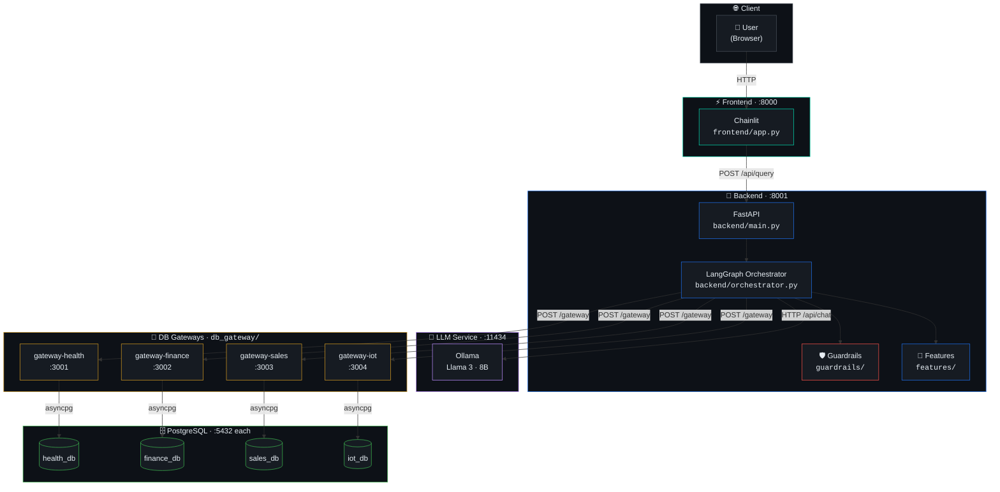
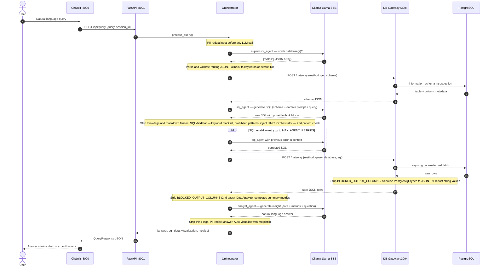
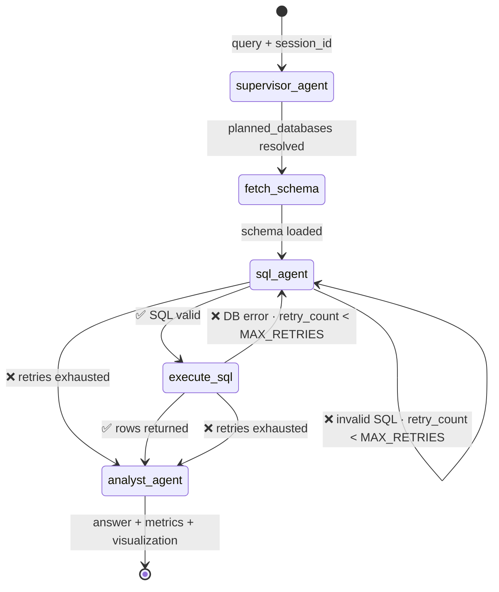
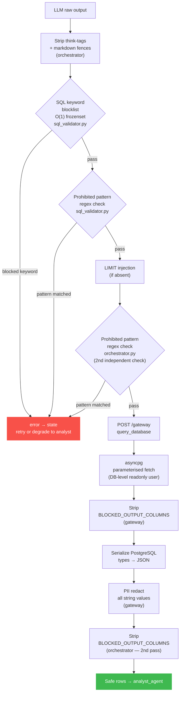
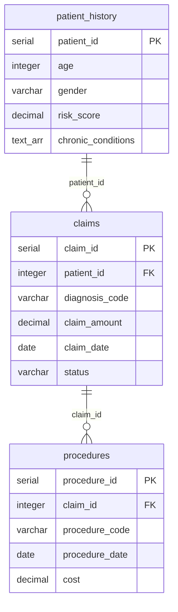
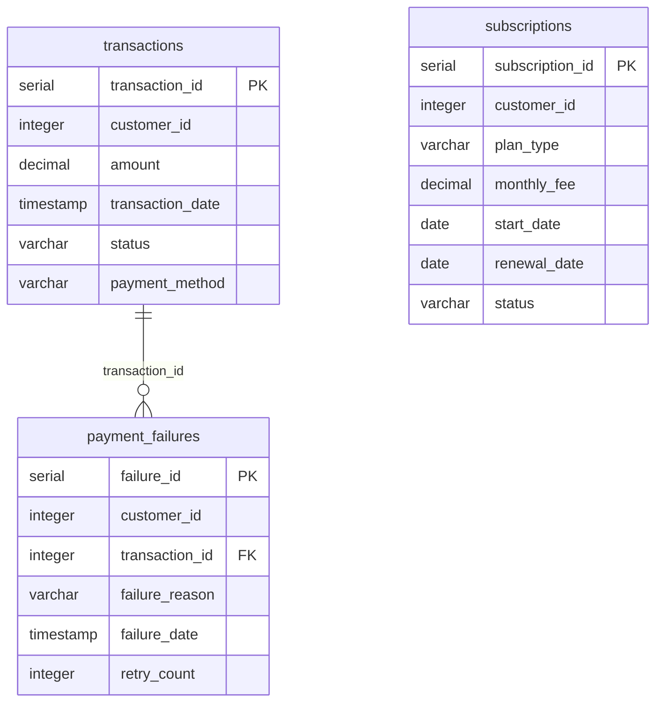
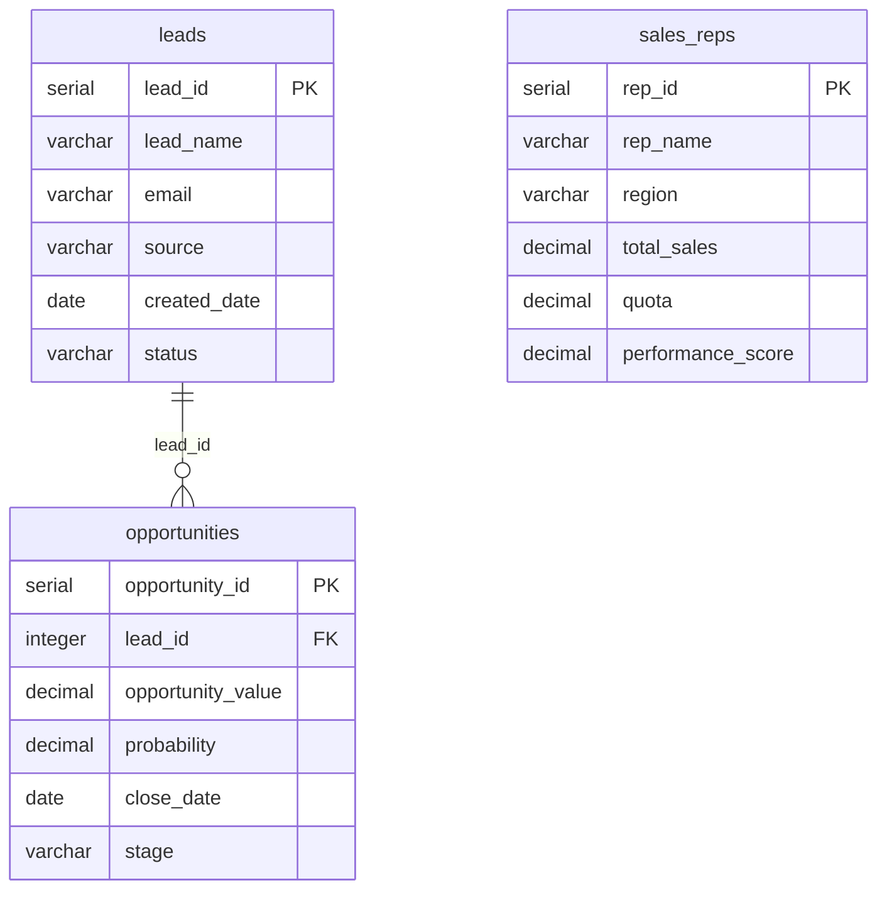
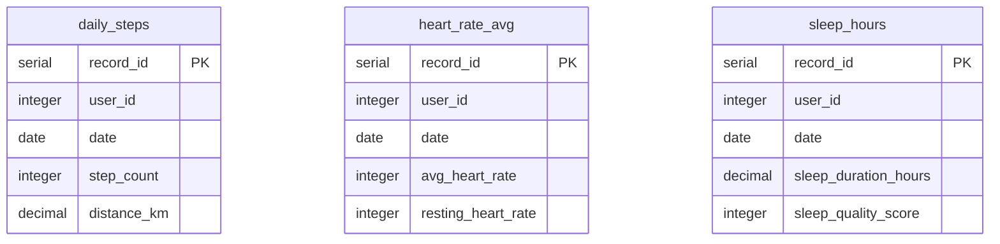
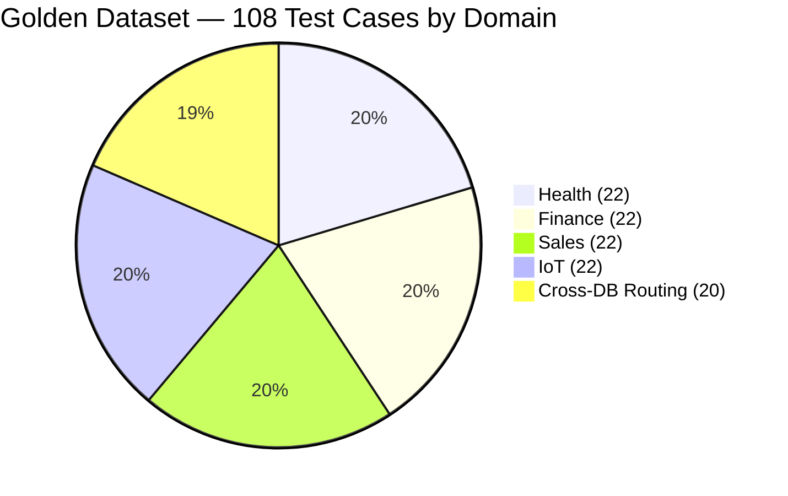

<div align='center'>

# LocalGenBI-Agent


> **This is a proof-of-concept / MVP.**
> It is a research and exploration project — not a production-ready system.
> There is no user authentication, no multi-tenancy, and no TLS between internal services.
> The LLM will generate incorrect SQL on complex multi-join queries.
> Read [Limitations](#limitations) before deploying outside your local machine.

*A locally-running generative BI agent that translates natural-language questions into SQL, routes them to the correct isolated PostgreSQL database, executes validated queries, and returns an analytical answer with an optional chart — all without sending data to any cloud API. Inference runs entirely on-device via Ollama (Llama 3 8B).*

</div>

---

## Table of Contents

- [Problem Statement](#problem-statement)
- [Solution Approach and Design Decisions](#solution-approach-and-design-decisions)
- [What Is Actually Built](#what-is-actually-built)
- [System Architecture](#system-architecture)
- [Agent Data Flow](#agent-data-flow)
- [LangGraph State Machine](#langgraph-state-machine)
- [Guardrails Pipeline](#guardrails-pipeline)
- [Statistical Analysis Layer](#statistical-analysis-layer)
- [Project Structure](#project-structure)
- [Data Model](#data-model)
- [Security Measures](#security-measures)
- [Limitations](#limitations)
- [Quickstart](#quickstart)
- [All Start Commands](#all-start-commands)
- [Port Reference](#port-reference)
- [Documentation](#documentation)
- [Evaluation](#evaluation)

---

## Problem Statement

> **Organisations with multiple isolated operational databases face a persistent last-mile problem: business analysts need answers from these databases, but the path from question to answer requires SQL — a skill most business users do not have.**

Existing approaches have notable constraints:

| Approach | Constraint |
|---|---|
| Cloud Text-to-SQL (GPT-4, Gemini, etc.) | Query text and schema metadata leave your infrastructure |
| Pre-built BI dashboards | Cannot answer ad-hoc questions outside the pre-built report set |
| Single-schema data warehouse | Requires ETL pipelines and schema unification before you get any value |
| On-prem enterprise BI tools | High cost; still require technical setup per data source |

**The constraint this project works under:** data and all query context must never leave the local network. Inference must run on-device on commodity hardware.

**Secondary constraint:** the system must handle multiple isolated databases with different schemas — not a single unified warehouse schema.

**Research question:** Can a locally-hosted smaller reasoning model (Llama 3 8B) serve as the backbone of a multi-domain NL-to-SQL agent, with explicit guardrails to compensate for its limitations?

---

## Solution Approach and Design Decisions

The system uses a five-node LangGraph state machine where each node calls either the local LLM (Ollama) or a database gateway. The key design choices and their rationale:

- **Isolated DB gateways over direct DB connections**: Each database domain gets its own aiohttp/asyncpg process running as a separate container. The backend never holds database credentials at query time — it calls the gateway over HTTP with SQL that has already been validated. A compromised backend process cannot directly access any database.

- **Multi-layer SQL guardrails**: The LLM generates SQL; the system does not trust it unconditionally. Two independent validation layers (keyword blocklist + prohibited-pattern regex) run before any SQL reaches a database. The guardrails are deterministic and cannot be bypassed by prompt injection — they will always reject `DROP TABLE` regardless of how the LLM frames it.

- **PII redaction at entry and exit**: The raw user query is PII-redacted before it enters any LLM prompt — names, phone numbers, emails in a query never reach the model. Database results are redacted again before they leave the backend, stripping any PII stored in the database from the API response.

- **Schema introspection at query time**: The agent does not have a hardcoded schema. It calls `get_schema` on the gateway every query. Schema changes are picked up automatically — no prompt rebuilding required when tables are added or modified.

- **Statistical validation layer**: A purpose-built `DataAnalyzer` class computes IQR outlier bounds, Pearson/Spearman correlations, and OLS trend slopes on query results before passing them to the analyst LLM. This means the LLM summarises statistically-grounded metrics rather than eyeballing raw numbers.

- **Local LLM + think-tag handling**: The think-tag stripping is retained for model-swap compatibility — switching OLLAMA_MODEL to DeepSeek-R1 or similar requires no code changes.

---

## What Is Actually Built

| Capability | Status | Notes |
|---|---|---|
| NL-to-SQL — Health domain | ✅ | |
| NL-to-SQL — Finance domain | ✅ | |
| NL-to-SQL — Sales domain | ✅ | |
| NL-to-SQL — IoT / Wearables domain | ✅ | |
| Supervisor routing (keyword + LLM two-phase) | ✅ | Accuracy varies with query ambiguity |
| Live schema introspection per query | ✅ | Not cached — always current |
| SQL read-only enforcement | ✅ | Keyword blocklist + DB-level readonly user |
| Prohibited SQL pattern blocking | ✅ | Two independent layers |
| Automatic LIMIT injection | ✅ | |
| PII redaction — input and output | ✅ | Regex: SSN, email, phone, CC |
| Blocked column stripping | ✅ | Two independent points in the data path |
| SQL retry on validation failure | ✅ | Up to `MAX_AGENT_RETRIES` (default 3) |
| Statistical analysis layer | ✅ | IQR outlier, Pearson/Spearman correlation, OLS trend |
| Auto-visualization — 4 chart types | ✅ | Rule-based chart type selection |
| Export: CSV, JSON, HTML, PNG, TXT, Analysis Report | ✅ | |
| Path-traversal-safe export filenames | ✅ | |
| Session history / multi-turn context | ✅ | Per-session in-memory store; injected into supervisor + analyst |
| Dark-themed Chainlit chat UI | ✅ | |
| Docker Compose — 11 services | ✅ | Health-gated dependency chain |
| Evaluation harness (DeepEval) | ✅ | 108 golden test cases across 5 domains |
| User authentication | ❌ | Not implemented |
| Streaming LLM responses | ❌ | Blocking inference only |
| Rate limiting middleware | ❌ | Config field exists; no middleware wired |
| TLS between internal services | ❌ | Plain HTTP on Docker bridge network |
| Cross-DB SQL JOINs | ❌ | Config flag exists; not implemented — each query targets one DB |

---

## System Architecture



---

## Agent Data Flow



---

## LangGraph State Machine



**State dict fields passed between nodes:**

| Field | Type | Written by |
|---|---|---|
| `query` | `str` | API (PII-redacted at entry) |
| `session_id` | `str` | API |
| `planned_databases` | `List[str]` | supervisor_agent |
| `current_schema` | `str` | fetch_schema |
| `sql` | `str` | sql_agent |
| `data` | `List[Dict]` | execute_sql |
| `metrics` | `Dict` | analyst_agent |
| `answer` | `str` | analyst_agent |
| `errors` | `List[str]` | any failing node |
| `retry_count` | `int` | sql_agent / execute_sql |
| `visualization` | `Dict \| None` | analyst_agent |
| `is_cross_db` | `bool` | supervisor_agent |
| `cross_db_schemas` | `Dict[str, str]` | fetch_schema (cross-DB path) |
| `cross_db_results` | `Dict[str, List]` | execute_sql (cross-DB path) |

---

## Guardrails Pipeline

Every SQL statement the LLM produces passes through this deterministic pipeline before any database connection is acquired. The pipeline cannot be bypassed by prompt injection.



---

## Statistical Analysis Layer

`features/data_analyzer.py` computes statistical metrics on query results before passing them to the analyst LLM. This grounds the LLM's response in verified numbers rather than having it estimate from raw rows.

| Function | What it computes |
|---|---|
| `generate_summary_statistics()` | Shape, dtypes, missing value counts, per-column mean / median / std / Q1 / Q3 / IQR. ID-like columns (suffixed `_id`, `_key`) are excluded from numerical summaries. |
| `generate_correlation_analysis()` | Pairwise correlations for all non-ID numeric column pairs, ranked by absolute value. Supports `method='pearson'` (default, linear) and `method='spearman'` (rank-based, more robust for skewed financial / health data). |
| `detect_outliers()` | IQR (Tukey fence) with configurable sensitivity (1.5× standard, 3.0× conservative for right-skewed data) or Z-score (3-sigma). |
| `generate_time_series_analysis()` | OLS linear regression slope + direction, R², coefficient of variation, and half-period comparison. Trend threshold is normalised to `max(1% × |mean|, floor)` — prevents near-zero mean series from misclassifying noise as trends. |

The comprehensive report auto-detects chart-appropriate columns: date columns trigger time-series analysis; business-metric columns (`amount`, `revenue`, `value`, etc.) are preferred over arbitrary first-found numerics for the y-axis.

---

## Project Structure

```
local-genbi-agent/
│
├── backend/
│   ├── main.py                    FastAPI app + lifespan + all HTTP routes
│   ├── orchestrator.py            LangGraph graph + all 5 agent node functions
│   └── session_store.py           In-memory per-session history with async locks
│
├── config/
│   ├── settings.py                Pydantic BaseSettings — env vars + validators
│   ├── constants.py               Frozensets, enums, tuning constants (no secrets)
│   ├── prompts.py                 All LLM prompts in one file
│   ├── schemas.py                 Pydantic v2 request/response models
│   └── __init__.py
│
├── db_gateway/
│   ├── base_server.py             BaseDbServer: asyncpg pool, execute, serialize, security
│   └── gateway_factory.py         aiohttp app factory + CLI entry point
│                                    python -m db_gateway.gateway_factory <domain>
│
├── evaluation/
│   ├── agent_evaluator.py         DeepEval harness: routing + SQL coverage + answer quality
│   └── golden_dataset.json        108 labelled test cases across 5 domains
│
├── features/
│   ├── data_analyzer.py           Stats: IQR / correlation (Pearson+Spearman) / OLS trend
│   ├── export_manager.py          Unified export: path sanitisation + async cleanup scheduling
│   ├── result_generator.py        Pure rendering: CSV / JSON / HTML / Markdown / TXT
│   └── visualization_generator.py Matplotlib dark-theme: bar / line / scatter / histogram
│
├── frontend/
│   └── app.py                     Chainlit: message handlers + action callbacks + exports
│
├── guardrails/
│   ├── sql_validator.py           Keyword blocklist + pattern regex + LIMIT injection
│   ├── pii_redaction.py           Regex PII: SSN / email / phone / credit card
│   └── code_sandbox.py            AST validation + restricted exec environment
│
├── llm_client/
│   └── ollama_client.py           Async Ollama client: retry + think-tag strip + ping()
│
├── .chainlit/
│   ├── config.toml                Chainlit theme configuration
│   └── public/style.css           Custom dark BI CSS
│
├── setup_dbs.py                   One-time: create schemas + readonly_user (4 DBs)
├── create_demo_data.py            One-time: seed synthetic demo data (4 DBs)
├── docker-compose.yml             11 services, health-gated dependency chain
├── Dockerfile                     Multi-stage: base → builder → backend / frontend
├── requirements.txt               Pinned runtime + evaluation dependencies
├── .env.local                     Template: native Python dev (all localhost)
└── .env.docker                    Template: Docker Compose (Docker service hostnames)
```

---

## Data Model

All four domains are completely isolated — separate PostgreSQL instances, separate gateway processes, no shared tables. Each query targets exactly one database.

### Health — `health_db`



Demo data: 100 patients · 500 claims · ~600 procedures

### Finance — `finance_db`



Demo data: 1,000 transactions · 200 subscriptions · ~300 payment failures

### Sales — `sales_db`



Demo data: 300 leads · 150 opportunities · 20 sales reps

### IoT / Wearables — `iot_db`



Demo data: 50 users × 365 days = 18,250 rows per table. `user_id` is a business key — no FK constraints across IoT tables.

---

## Security Measures

The following controls are **actually implemented in the current codebase.**

| Control | Location | What it does |
|---|---|---|
| DB read-only user | `setup_dbs.py` | `readonly_user` has SELECT only — DDL/DML rejected at DB level unconditionally |
| SQL keyword blocklist | `guardrails/sql_validator.py` | Frozenset O(1): DROP, DELETE, INSERT, UPDATE, ALTER, TRUNCATE, EXEC, CALL, … |
| Prohibited SQL patterns | `sql_validator.py` + `orchestrator.py` | Regex: information_schema, pg_sleep, lo_*, COPY, xp_* — two independent checks |
| LIMIT injection | `guardrails/sql_validator.py` | Wraps result in outer query to enforce LIMIT regardless of subquery structure |
| Blocked column stripping | `db_gateway/base_server.py` + `orchestrator.py` | Column name blocklist stripped at two independent points in the data path |
| PII redaction — input | `orchestrator.py` | Query PII-redacted before entering any LLM prompt |
| PII redaction — output | `db_gateway/base_server.py` + `orchestrator.py` | All string values in results + LLM answer text |
| Export path sanitisation | `features/export_manager.py` | `Path.is_relative_to()` prevents path traversal — string prefix matching bypass is patched |
| XSS prevention in HTML exports | `features/result_generator.py` | `df.to_html(escape=True)` |
| Production SSL guard | `config/settings.py` | `ValidationError` at startup if `ENVIRONMENT=production` and SSL disabled |
| Code sandbox | `guardrails/code_sandbox.py` | AST validation + restricted exec: blocks builtins + non-whitelisted imports |
| Non-root Docker user | `Dockerfile` | Backend + frontend run as `appuser`, not root |

**Not implemented:** authentication, authorisation, TLS between internal services, audit logging, rate limiting middleware (config field exists, no middleware wired).

---

## Limitations

### SQL generation accuracy

Llama 3 8B will produce incorrect SQL. It is weakest on:

- Multi-table JOINs with 3+ tables and non-obvious join keys
- PostgreSQL-specific aggregate expressions (window functions, CASE WHEN in GROUP BY)
- Queries where the correct table is not directly named in the question
- Queries requiring date arithmetic against `CURRENT_DATE`

The retry mechanism recovers from syntactic errors but not semantic misunderstandings. If the model consistently misunderstands a query type, retrying will not help.

### Single-database per query

The supervisor picks one database per query. There is no mechanism to JOIN tables across two PostgreSQL instances. `ENABLE_CROSS_DB_JOINS=false` is a configuration field; setting it to `true` does not enable the feature — cross-DB JOINs are not implemented. The supervisor routing tests in the evaluation harness test single-database routing for queries with ambiguous domain language (e.g. "What is our churn rate?" → finance), not actual cross-database SQL.

### Supervisor routing is imperfect

The keyword + LLM two-phase routing handles clear domain-specific queries well. It degrades on queries using generic business language ("cost", "revenue", "performance", "users") that could plausibly map to multiple databases. The golden dataset includes 20 deliberately ambiguous routing cases to measure exactly this failure mode.

### Session memory is in-process only

Session history is stored in a Python dict in the FastAPI process memory. It is not persisted to disk or a database. Restarting the backend clears all session history. Multiple uvicorn workers (`FASTAPI_WORKERS > 1`) will not share session state. For the single-worker default configuration this works correctly.

### Blocking, slow inference

A single query makes 2–4 LLM calls (supervisor + possible retries + analyst). On CPU-only hardware this can take 2–5 minutes total. There is no streaming — the HTTP connection stays open for the full duration. The frontend shows a loading indicator.

### Regex PII redaction is not comprehensive

The redaction patterns cover common formats (SSN `\d{3}-\d{2}-\d{4}`, email, phone, Visa/Mastercard). Non-standard formats, international formats, and contextual PII (names in free text) will not be caught. Do not treat this as a compliance tool.

### Heuristic visualization

Chart type is selected by column dtype rules — the agent does not understand query intent when choosing a chart. Many result sets will produce a chart that is technically correct but not the most insightful representation. Scatter plots are sampled to 2,000 points for performance.

### No multi-user isolation

All Chainlit users share the same backend process with no isolation between sessions beyond the in-memory session store. Do not expose this to untrusted users or the public internet without adding authentication.

---

## Quickstart

See [QUICK_STARTUP.md](docs/QUICK_STARTUP.md) for full prerequisites, step-by-step instructions, and troubleshooting.

**Docker — fastest path:**

```bash
cp .env.docker .env
# Open .env and fill in all lines marked  ← REQUIRED
docker compose up -d
docker exec localgenbi-ollama ollama pull llama3:8b
docker exec localgenbi-backend python setup_dbs.py
docker exec localgenbi-backend python create_demo_data.py
# Open browser: http://localhost:8000
```

**Native Python:**

```bash
cp .env.local .env
# Open .env and fill in all lines marked  ← REQUIRED
python -m venv .venv && source .venv/bin/activate
pip install -r requirements.txt
python setup_dbs.py
python create_demo_data.py
# Then start 6 processes — see All Start Commands below
```

---

## All Start Commands

### Native Python (6 processes)

Run each in a separate terminal from the project root with the virtual environment active.

```bash
# Terminal 1 — DB gateway: Health  (:3001)
python -m db_gateway.gateway_factory health

# Terminal 2 — DB gateway: Finance  (:3002)
python -m db_gateway.gateway_factory finance

# Terminal 3 — DB gateway: Sales  (:3003)
python -m db_gateway.gateway_factory sales

# Terminal 4 — DB gateway: IoT  (:3004)
python -m db_gateway.gateway_factory iot

# Terminal 5 — FastAPI backend  (:8001)
uvicorn backend.main:app --host 0.0.0.0 --port 8001 --reload

# Terminal 6 — Chainlit frontend  (:8000)
chainlit run frontend/app.py --host 0.0.0.0 --port 8000
```

Verify each gateway is up before sending queries:

```bash
curl http://localhost:3001/health   # {"status":"healthy","domain":"health",...}
curl http://localhost:3002/health
curl http://localhost:3003/health
curl http://localhost:3004/health
curl http://localhost:8001/health   # {"status":"healthy","ollama_status":"running",...}
```

### Docker Compose

```bash
# Start all 11 services in background
docker compose up -d

# Watch all logs live
docker compose logs -f

# Watch a single service
docker compose logs -f backend
docker compose logs -f gateway-health

# Check service health status
docker compose ps

# Stop all services (preserves data volumes)
docker compose down

# Stop and delete all data volumes
docker compose down -v

# Rebuild images after code changes
docker compose build --no-cache
docker compose up -d

# One-off commands inside a running container
docker exec localgenbi-backend python setup_dbs.py
docker exec localgenbi-backend python create_demo_data.py

# Run evaluation inside Docker (dry-run — no backend calls)
docker exec localgenbi-backend python evaluation/agent_evaluator.py --dry-run

# Run full evaluation
docker exec localgenbi-backend \
    python evaluation/agent_evaluator.py \
    --backend http://localhost:8001 \
    --output /app/temp/exports/eval_results.json
```

---

## Port Reference

| Service | Default port | Env var to change |
|---|---|---|
| Chainlit UI | 8000 | `CHAINLIT_PORT` |
| FastAPI backend | 8001 | `FASTAPI_PORT` |
| DB gateway — health | 3001 | `GATEWAY_HEALTH_PORT` |
| DB gateway — finance | 3002 | `GATEWAY_FINANCE_PORT` |
| DB gateway — sales | 3003 | `GATEWAY_SALES_PORT` |
| DB gateway — iot | 3004 | `GATEWAY_IOT_PORT` |
| Ollama | 11434 | Ollama config file |
| PostgreSQL (each instance) | 5432 | `DB_*_PORT` |

If you change any port, update both `.env` and the corresponding `ports:` mapping in `docker-compose.yml`.

---

## Documentation

| File | Contents |
|---|---|
| [QUICK_STARTUP.md](docs/QUICK_STARTUP.md) | Full prerequisites, setup steps, port reference, troubleshooting |
| [API_DOCUMENTATION.md](docs/API_DOCUMENTATION.md) | FastAPI endpoint reference: request/response schemas, examples, error codes |
| [SYSTEM_DOCUMENTATION.md](docs/SYSTEM_DOCUMENTATION.md) | Architecture deep-dive: agent pipeline, serialisation, stats, export flow |
| [EVALUATION_GUIDE.md](docs/EVALUATION_GUIDE.md) | How to run evaluation, interpret scores, extend the dataset |

---

## Evaluation

The agent is evaluated against 108 labelled test cases in `evaluation/golden_dataset.json`.



| Metric | Method | Notes |
|---|---|---|
| Routing accuracy | Table-name fingerprint vs `expected_database` | Single-domain + cross-domain split reported separately |
| SQL keyword coverage | `expected_sql_keywords` present in generated SQL | Reported as % coverage per case — structural proxy, not semantic correctness |
| Answer relevancy | DeepEval `AnswerRelevancyMetric` | Threshold 0.7 |
| Answer faithfulness | DeepEval `FaithfulnessMetric` | Threshold 0.7 |

```bash
# Dry-run — print all 108 cases, no backend calls
python evaluation/agent_evaluator.py --dry-run

# Full evaluation against local backend, save results
python evaluation/agent_evaluator.py \
    --backend http://localhost:8001 \
    --output results.json

# Single domain (22 cases)
python evaluation/agent_evaluator.py --domain health --backend http://localhost:8001

# Cross-DB routing tests only (20 cases)
python evaluation/agent_evaluator.py --domain cross_db_routing --backend http://localhost:8001

# Smoke-test: first 10 cases only
python evaluation/agent_evaluator.py --limit 10 --backend http://localhost:8001
```

See [EVALUATION_GUIDE.md](EVALUATION_GUIDE.md) for the complete guide including dataset structure, score interpretation, and how to add your own test cases.


### Benchmark Results

> Run `python evaluation/agent_evaluator.py --backend http://localhost:8001 --output evaluation/eval_results.json` to reproduce.

| Metric | Score | Notes |
|---|---|---|
| Routing accuracy (overall) | — | 88 single-domain cases |
| Routing accuracy (cross-DB) | — | 20 ambiguous routing cases |
| SQL keyword coverage (avg) | — | Structural proxy — not semantic correctness |
| Answer relevancy (DeepEval) | — | Threshold 0.7 · model: DeepSeek-R1 8B |
| Faithfulness (DeepEval) | — | Threshold 0.7 · model: DeepSeek-R1 8B |

**Dataset breakdown — 108 cases:**

| Domain | Easy | Medium | Hard | Total |
|---|---|---|---|---|
| Health | 6 | 11 | 5 | 22 |
| Finance | 6 | 11 | 5 | 22 |
| Sales | 6 | 12 | 4 | 22 |
| IoT | 6 | 12 | 4 | 22 |
| Cross-DB routing | 2 | 9 | 9 | 20 |
| **Total** | **26** | **55** | **27** | **108** |

> ⚠️ Scores reflect Llama 3 8B (inference model) judged by DeepSeek-R1 8B (evaluator). SQL keyword coverage is a structural proxy — a query can pass keyword coverage but return semantically wrong results on complex multi-join patterns. See [Limitations](#limitations).

---

## Author

**Satyaki Mitra** [GitHub](https://github.com/satyaki-mitra)

---

## References

- **Meta Llama 3 (8B)** — Meta AI (2024). [Introducing Meta Llama 3](https://ai.meta.com/blog/meta-llama-3/) — primary inference model for SQL generation and BI analysis
- **DeepSeek-R1 (8B)** — Guo et al. (2025). [DeepSeek-R1: Incentivizing Reasoning Capability in LLMs via Reinforcement Learning](https://arxiv.org/abs/2501.12948) — used as the DeepEval evaluator model only
- **LangGraph** — Harrison Chase et al. [LangGraph: Build stateful, multi-actor applications with LLMs](https://github.com/langchain-ai/langgraph)
- **DeepEval** — [Confident AI — LLM Evaluation Framework](https://github.com/confident-ai/deepeval)
- **Chainlit** — [Chainlit: Build Conversational AI](https://github.com/Chainlit/chainlit)
- **Text-to-SQL survey** — Qin et al. (2022). [A Survey on Text-to-SQL Parsing](https://arxiv.org/abs/2208.13629)
- **Ollama** — [Run large language models locally](https://ollama.com)

---

## Conclusion

This project demonstrates that a locally-hosted 8B reasoning model can serve as the backbone of a functional multi-domain NL-to-SQL agent — with deterministic guardrails compensating for the model's SQL generation limitations on complex queries.

The key finding is that **routing and SQL generation are separable problems with different failure modes.** Routing fails on ambiguous domain language; SQL generation fails on structural complexity (multi-join, window functions). Addressing them requires different mitigations — better routing prompts vs. schema-aware SQL repair loops — and the evaluation harness is designed to measure each independently.

This is not a production system. The SQL accuracy of an 8B model on medium-to-hard queries is insufficient for unsupervised deployment. The appropriate next steps would be fine-tuning a domain-specific SQL model, adding a human-in-the-loop review step for low-confidence queries, or upgrading to a larger model with sufficient VRAM.
